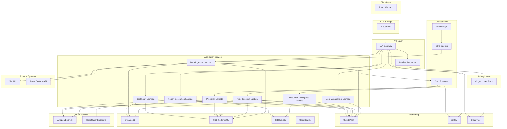

# Design Document: AI SW Program Manager

## Overview

The AI SW Program Manager is a multi-tenant SaaS platform built on AWS serverless architecture that provides AI-powered program management capabilities. The platform ingests project data from external systems (Jira, Azure DevOps), analyzes it using machine learning models, extracts intelligence from unstructured documents, detects risks, generates predictions, and produces automated reports.

### Core Design Principles

1. **Serverless-First**: Leverage AWS Lambda, API Gateway, and managed services to minimize operational overhead and enable automatic scaling
2. **Multi-Tenancy**: Strict tenant isolation at all layers (data, compute, search) to ensure security and compliance
3. **AI-Driven Insights**: Use Amazon Bedrock for generative AI and SageMaker for predictive models to provide actionable intelligence
4. **Event-Driven Architecture**: Use asynchronous processing for data ingestion, analysis, and report generation
5. **Human-in-the-Loop**: Provide confirmation workflows for AI-extracted data before committing to system of record
6. **API-First**: Design all functionality as REST APIs to support future mobile and third-party integrations

### Technology Stack

- **Frontend**: React SPA hosted on S3, distributed via CloudFront
- **API Layer**: API Gateway (REST) with Lambda authorizers
- **Authentication**: AWS Cognito User Pools with JWT tokens
- **Compute**: AWS Lambda (Node.js/Python) orchestrated by Step Functions
- **AI/ML**: Amazon Bedrock (Claude/Titan), SageMaker (custom models)
- **Storage**: DynamoDB (metadata), RDS PostgreSQL (relational data), S3 (documents)
- **Search**: Amazon OpenSearch with vector embeddings
- **Messaging**: EventBridge for event routing, SQS for queue-based processing
- **Monitoring**: CloudWatch (logs, metrics, alarms), X-Ray (tracing), CloudTrail (audit)

## Architecture


### High-Level Architecture Diagram



### Architecture Layers

#### 1. Presentation Layer
- **React SPA**: Single-page application with responsive design
- **CloudFront**: Global CDN for low-latency content delivery
- **S3 Static Hosting**: Hosts compiled React application assets

#### 2. API Gateway Layer
- **REST API**: Exposes all platform functionality via RESTful endpoints
- **Lambda Authorizer**: Validates JWT tokens from Cognito on each request
- **Request Validation**: Schema validation for incoming requests
- **Rate Limiting**: Per-tenant and per-user rate limits
- **CORS Configuration**: Enables secure cross-origin requests from web app

#### 3. Authentication & Authorization Layer
- **Cognito User Pools**: Manages user identities, authentication, and JWT token issuance
- **Custom Attributes**: Stores tenant_id and role as custom user attributes
- **MFA Support**: Optional multi-factor authentication for enhanced security
- **Token Refresh**: Automatic token refresh for seamless user experience

#### 4. Application Service Layer
- **User Management Service**: Handles user CRUD, role assignment, tenant association
- **Data Ingestion Service**: Orchestrates data fetch from external APIs
- **Risk Detection Service**: Analyzes project data to identify risks
- **Prediction Service**: Generates ML-based predictions for delays and workload
- **Document Intelligence Service**: Extracts structured data from unstructured documents
- **Report Generation Service**: Creates automated reports with AI-generated narratives
- **Dashboard Service**: Aggregates and serves dashboard data

#### 5. Orchestration Layer
- **Step Functions**: Coordinates multi-step workflows (ingestion → analysis → alerting)
- **EventBridge**: Routes events between services (scheduled ingestion, risk alerts)
- **SQS**: Buffers high-volume processing tasks (document processing, batch predictions)

#### 6. AI/ML Layer
- **Amazon Bedrock**: Provides LLM capabilities for text generation, extraction, and summarization
- **SageMaker**: Hosts custom ML models for delay prediction and workload forecasting
- **Model Registry**: Tracks model versions and performance metrics

#### 7. Data Layer
- **DynamoDB**: Stores user profiles, tenant configurations, risk alerts, predictions
- **RDS PostgreSQL**: Stores relational project data (sprints, tasks, milestones, metrics)
- **S3**: Stores uploaded documents, generated reports, model artifacts
- **OpenSearch**: Provides vector search for semantic document queries

#### 8. Monitoring & Observability Layer
- **CloudWatch Logs**: Centralized logging for all Lambda functions
- **CloudWatch Metrics**: Custom metrics for business KPIs (ingestion success rate, prediction accuracy)
- **CloudWatch Alarms**: Automated alerting for error rates, latency, and resource utilization
- **X-Ray**: Distributed tracing for request flow analysis
- **CloudTrail**: Audit logging for security and compliance

## Components and Interfaces


### 1. Authentication Service

**Responsibility**: Authenticate users and validate authorization for API requests

**Technology**: AWS Cognito User Pools, Lambda Authorizer

**Interfaces**:

```typescript
// POST /auth/login
interface LoginRequest {
  email: string;
  password: string;
}

interface LoginResponse {
  accessToken: string;
  refreshToken: string;
  expiresIn: number;
  user: {
    userId: string;
    email: string;
    tenantId: string;
    role: string;
  };
}

// POST /auth/refresh
interface RefreshRequest {
  refreshToken: string;
}

interface RefreshResponse {
  accessToken: string;
  expiresIn: number;
}

// POST /auth/logout
interface LogoutRequest {
  accessToken: string;
}

interface LogoutResponse {
  success: boolean;
}

// Lambda Authorizer Context
interface AuthorizerContext {
  userId: string;
  tenantId: string;
  role: string;
  email: string;
}
```

**Implementation Details**:
- Cognito handles password hashing, token generation, and session management
- Lambda Authorizer validates JWT signature and extracts claims
- Tenant ID is stored as custom attribute in Cognito user profile
- All API requests include Authorization header with Bearer token
- Token expiration: 1 hour (access token), 30 days (refresh token)

### 2. User Management Service

**Responsibility**: Manage user accounts, roles, and tenant associations

**Technology**: Lambda (Node.js), DynamoDB

**Interfaces**:

```typescript
// POST /users
interface CreateUserRequest {
  email: string;
  firstName: string;
  lastName: string;
  role: 'ADMIN' | 'PROGRAM_MANAGER' | 'EXECUTIVE' | 'TEAM_MEMBER';
  tenantId: string; // Validated against requester's tenant
}

interface CreateUserResponse {
  userId: string;
  email: string;
  temporaryPassword: string;
}

// GET /users
interface ListUsersRequest {
  tenantId: string; // Auto-populated from auth context
  limit?: number;
  nextToken?: string;
}

interface ListUsersResponse {
  users: User[];
  nextToken?: string;
}

// PUT /users/{userId}/role
interface UpdateUserRoleRequest {
  role: string;
}

interface UpdateUserRoleResponse {
  userId: string;
  role: string;
}

interface User {
  userId: string;
  email: string;
  firstName: string;
  lastName: string;
  role: string;
  tenantId: string;
  createdAt: string;
  lastLogin?: string;
}
```

**Implementation Details**:
- DynamoDB table: `Users` with partition key `tenantId`, sort key `userId`
- GSI on `email` for lookup during authentication
- Role-based access control enforced at API Gateway level
- Only ADMIN role can create/modify users
- Tenant isolation enforced by filtering all queries by tenantId from auth context

### 3. Data Ingestion Service

**Responsibility**: Fetch project data from external systems and store in platform database

**Technology**: Lambda (Python), Step Functions, EventBridge, SQS

**Interfaces**:

```typescript
// POST /integrations/jira/configure
interface ConfigureJiraRequest {
  tenantId: string;
  jiraUrl: string;
  authType: 'OAUTH' | 'API_TOKEN';
  credentials: {
    apiToken?: string;
    oauthClientId?: string;
    oauthClientSecret?: string;
  };
  projectKeys: string[];
  syncSchedule: string; // Cron expression
}

interface ConfigureJiraResponse {
  integrationId: string;
  status: 'ACTIVE' | 'PENDING';
}

// POST /integrations/azure-devops/configure
interface ConfigureAzureDevOpsRequest {
  tenantId: string;
  organizationUrl: string;
  personalAccessToken: string;
  projectNames: string[];
  syncSchedule: string;
}

interface ConfigureAzureDevOpsResponse {
  integrationId: string;
  status: 'ACTIVE' | 'PENDING';
}

// POST /integrations/{integrationId}/sync
interface TriggerSyncRequest {
  integrationId: string;
}

interface TriggerSyncResponse {
  syncJobId: string;
  status: 'QUEUED' | 'IN_PROGRESS';
}

// GET /integrations/{integrationId}/sync/{syncJobId}
interface GetSyncStatusResponse {
  syncJobId: string;
  status: 'QUEUED' | 'IN_PROGRESS' | 'COMPLETED' | 'FAILED';
  startedAt?: string;
  completedAt?: string;
  recordsProcessed?: number;
  errors?: string[];
}
```

**Data Models**:

```typescript
interface ProjectData {
  tenantId: string;
  projectId: string;
  projectName: string;
  source: 'JIRA' | 'AZURE_DEVOPS';
  lastSyncAt: string;
  metrics: ProjectMetrics;
}

interface ProjectMetrics {
  sprints: Sprint[];
  backlog: BacklogMetrics;
  milestones: Milestone[];
  resources: ResourceAllocation[];
  dependencies: Dependency[];
}

interface Sprint {
  sprintId: string;
  sprintName: string;
  startDate: string;
  endDate: string;
  velocity: number;
  completedPoints: number;
  plannedPoints: number;
  completionRate: number;
}

interface BacklogMetrics {
  totalIssues: number;
  issuesByType: Record<string, number>; // bug, feature, technical_debt
  issuesByPriority: Record<string, number>;
  averageAge: number; // days
  growthRate: number; // percentage
}

interface Milestone {
  milestoneId: string;
  name: string;
  dueDate: string;
  completionPercentage: number;
  status: 'ON_TRACK' | 'AT_RISK' | 'DELAYED';
  dependencies: string[]; // milestoneIds
}

interface ResourceAllocation {
  userId: string;
  userName: string;
  allocatedHours: number;
  capacity: number;
  utilizationRate: number;
}

interface Dependency {
  dependencyId: string;
  sourceTaskId: string;
  targetTaskId: string;
  type: 'BLOCKS' | 'RELATES_TO';
  status: 'ACTIVE' | 'RESOLVED';
}
```

**Implementation Details**:
- EventBridge scheduled rules trigger ingestion based on configured cron expressions
- Step Functions orchestrate multi-step ingestion workflow:
  1. Fetch data from external API
  2. Validate and transform data
  3. Store in RDS PostgreSQL
  4. Update metadata in DynamoDB
  5. Trigger downstream analysis (risk detection, predictions)
- SQS queue buffers ingestion jobs to handle rate limits
- Exponential backoff retry logic for API failures (1s, 2s, 4s, 8s, 16s, max 60s)
- Credentials stored encrypted in AWS Secrets Manager
- RDS tables: `projects`, `sprints`, `backlog_items`, `milestones`, `resources`, `dependencies`

### 4. Risk Detection Service

**Responsibility**: Analyze project data to identify velocity trends, backlog growth, and milestone slippage risks

**Technology**: Lambda (Python), Amazon Bedrock, RDS PostgreSQL

**Interfaces**:

```typescript
// POST /analysis/detect-risks
interface DetectRisksRequest {
  tenantId: string;
  projectId: string;
}

interface DetectRisksResponse {
  risks: Risk[];
  analysisTimestamp: string;
}

interface Risk {
  riskId: string;
  projectId: string;
  type: 'VELOCITY_DECLINE' | 'BACKLOG_GROWTH' | 'MILESTONE_SLIPPAGE';
  severity: 'LOW' | 'MEDIUM' | 'HIGH' | 'CRITICAL';
  title: string;
  description: string; // AI-generated explanation
  detectedAt: string;
  metrics: RiskMetrics;
  recommendations: string[]; // AI-generated suggestions
}

interface RiskMetrics {
  currentValue: number;
  threshold: number;
  trend: 'IMPROVING' | 'STABLE' | 'DECLINING';
  historicalData: Array<{ date: string; value: number }>;
}

// GET /risks
interface ListRisksRequest {
  tenantId: string;
  projectId?: string;
  severity?: string;
  status?: 'ACTIVE' | 'DISMISSED' | 'RESOLVED';
  limit?: number;
  nextToken?: string;
}

interface ListRisksResponse {
  risks: Risk[];
  nextToken?: string;
}

// PUT /risks/{riskId}/dismiss
interface DismissRiskRequest {
  reason: string;
}

interface DismissRiskResponse {
  riskId: string;
  status: 'DISMISSED';
  dismissedBy: string;
  dismissedAt: string;
}
```

**Risk Detection Algorithms**:

1. **Velocity Decline Detection**:
   - Calculate 4-sprint moving average velocity
   - Compare current sprint velocity to moving average
   - If decline > 20% for 2 consecutive sprints → Generate HIGH risk
   - If decline > 30% for 2 consecutive sprints → Generate CRITICAL risk

2. **Backlog Growth Detection**:
   - Calculate weekly backlog growth rate
   - Calculate team's average weekly completion rate
   - If growth > 30% in single week → Generate MEDIUM risk
   - If backlog size > 2x weekly completion rate → Generate HIGH risk

3. **Milestone Slippage Detection**:
   - Calculate completion percentage for each milestone
   - Calculate time remaining as percentage
   - If completion < 70% and time remaining < 20% → Generate HIGH risk
   - If completion < 50% and time remaining < 10% → Generate CRITICAL risk
   - Identify downstream dependent milestones at risk

**AI-Generated Explanations**:
- Use Amazon Bedrock (Claude) to generate natural language explanations
- Prompt template includes risk type, metrics, and historical context
- Example prompt: "Explain why this project is experiencing velocity decline. Current velocity: 25 points, 4-sprint average: 35 points, previous sprints: [40, 38, 32, 30]. Provide actionable recommendations."

**Implementation Details**:
- Triggered automatically after data ingestion completes
- Queries RDS for project metrics and historical trends
- Stores detected risks in DynamoDB table: `Risks`
- Publishes risk events to EventBridge for notification routing
- Caches risk calculations for 1 hour to reduce compute costs

### 5. Prediction Service

**Responsibility**: Generate ML-based predictions for project delays and workload imbalances

**Technology**: Lambda (Python), SageMaker, RDS PostgreSQL

**Interfaces**:

```typescript
// POST /predictions/delay-probability
interface PredictDelayRequest {
  tenantId: string;
  projectId: string;
}

interface PredictDelayResponse {
  projectId: string;
  delayProbability: number; // 0-100
  confidenceScore: number; // 0-1
  predictedDelayDays?: number;
  factors: PredictionFactor[];
  generatedAt: string;
}

interface PredictionFactor {
  factor: string;
  impact: number; // -1 to 1
  description: string;
}

// POST /predictions/workload-imbalance
interface PredictWorkloadRequest {
  tenantId: string;
  projectId: string;
}

interface PredictWorkloadResponse {
  projectId: string;
  imbalanceScore: number; // 0-100, higher = more imbalanced
  confidenceScore: number;
  overallocatedResources: ResourcePrediction[];
  underallocatedResources: ResourcePrediction[];
  recommendations: string[];
  generatedAt: string;
}

interface ResourcePrediction {
  userId: string;
  userName: string;
  predictedUtilization: number;
  currentUtilization: number;
  variance: number;
}

// GET /predictions/history
interface GetPredictionHistoryRequest {
  tenantId: string;
  projectId: string;
  predictionType: 'DELAY' | 'WORKLOAD';
  startDate: string;
  endDate: string;
}

interface GetPredictionHistoryResponse {
  predictions: Array<{
    timestamp: string;
    prediction: number;
    confidence: number;
    actual?: number; // Populated after outcome is known
  }>;
  accuracy: number; // Overall accuracy percentage
}
```

**ML Models**:

1. **Delay Prediction Model**:
   - **Algorithm**: Gradient Boosting (XGBoost)
   - **Features**: 
     - Velocity trend (last 4 sprints)
     - Backlog size and growth rate
     - Milestone completion percentage
     - Historical delay patterns
     - Team size and experience
     - Dependency count and complexity
   - **Target**: Binary classification (delayed / on-time) + regression (delay days)
   - **Training Data**: Historical project data with known outcomes
   - **Retraining**: Monthly with accumulated data
   - **Evaluation Metrics**: Precision, Recall, F1-Score, RMSE (for delay days)

2. **Workload Imbalance Model**:
   - **Algorithm**: Random Forest Regression
   - **Features**:
     - Current resource allocation
     - Task assignment distribution
     - Historical utilization patterns
     - Skill match scores
     - Task complexity estimates
   - **Target**: Utilization variance across team members
   - **Training Data**: Historical resource allocation with actual utilization
   - **Retraining**: Monthly
   - **Evaluation Metrics**: MAE, RMSE, R²

**Implementation Details**:
- SageMaker hosts trained models as real-time endpoints
- Lambda invokes SageMaker endpoints for predictions
- Feature engineering performed in Lambda before model invocation
- Predictions stored in DynamoDB table: `Predictions`
- Model artifacts stored in S3: `s3://{bucket}/models/{model-name}/{version}/`
- Model registry tracks versions, performance metrics, and deployment status
- A/B testing supported for gradual model rollout


### 6. Document Intelligence Service

**Responsibility**: Extract structured information from unstructured documents using AI

**Technology**: Lambda (Python), Amazon Bedrock, AWS Textract, S3, OpenSearch

**Interfaces**:

```typescript
// POST /documents/upload
interface UploadDocumentRequest {
  tenantId: string;
  projectId: string;
  documentType: 'SOW' | 'BRD' | 'TECHNICAL_SPEC' | 'CHANGE_REQUEST' | 'MEETING_MINUTES' | 'EXECUTIVE_COMM';
  fileName: string;
  fileSize: number;
  contentType: string;
}

interface UploadDocumentResponse {
  documentId: string;
  uploadUrl: string; // Pre-signed S3 URL
  expiresIn: number;
}

// POST /documents/{documentId}/process
interface ProcessDocumentRequest {
  documentId: string;
}

interface ProcessDocumentResponse {
  documentId: string;
  status: 'PROCESSING' | 'COMPLETED' | 'FAILED';
  jobId: string;
}

// GET /documents/{documentId}/extractions
interface GetExtractionsResponse {
  documentId: string;
  documentType: string;
  extractions: Extraction[];
  processingStatus: 'COMPLETED' | 'PROCESSING' | 'FAILED';
}

interface Extraction {
  extractionId: string;
  type: 'MILESTONE' | 'SLA' | 'DELIVERABLE' | 'RISK' | 'DECISION';
  content: string;
  confidence: number; // 0-1
  metadata: Record<string, any>;
  requiresReview: boolean; // true if confidence < 0.7
  status: 'PENDING_REVIEW' | 'CONFIRMED' | 'REJECTED';
}

// PUT /documents/{documentId}/extractions/{extractionId}/confirm
interface ConfirmExtractionRequest {
  confirmed: boolean;
  correctedContent?: string;
}

interface ConfirmExtractionResponse {
  extractionId: string;
  status: 'CONFIRMED' | 'REJECTED';
}

// POST /documents/search
interface SearchDocumentsRequest {
  tenantId: string;
  query: string; // Natural language query
  documentTypes?: string[];
  projectIds?: string[];
  dateRange?: { start: string; end: string };
  limit?: number;
}

interface SearchDocumentsResponse {
  results: SearchResult[];
  totalResults: number;
}

interface SearchResult {
  documentId: string;
  documentName: string;
  documentType: string;
  projectId: string;
  relevanceScore: number;
  highlights: string[]; // Relevant text passages
  uploadedAt: string;
}
```

**Extraction Workflows**:

1. **SOW Milestone Extraction**:
   - Extract text using AWS Textract
   - Use Bedrock (Claude) with structured prompt:
     ```
     Extract all milestones from this Statement of Work.
     For each milestone, identify:
     - Milestone name
     - Due date
     - Deliverables
     - Success criteria
     Return as JSON array.
     ```
   - Parse LLM response into structured Extraction objects
   - Flag extractions with confidence < 0.7 for human review
   - Present to user for confirmation
   - On confirmation, create Milestone records in RDS

2. **SLA Clause Extraction**:
   - Extract text using AWS Textract
   - Use Bedrock with structured prompt:
     ```
     Extract all SLA clauses from this contract.
     For each SLA, identify:
     - SLA metric name
     - Target threshold
     - Measurement period
     - Penalty clause
     Return as JSON array.
     ```
   - Parse and structure extractions
   - On confirmation, create monitoring rules in DynamoDB

3. **Semantic Search**:
   - Generate embeddings for document chunks using Bedrock Titan Embeddings
   - Store embeddings in OpenSearch vector index
   - Index structure: `{tenantId}-documents`
   - On search query, generate query embedding
   - Perform k-NN search in OpenSearch
   - Return top-k results with highlighted passages

**Implementation Details**:
- Documents uploaded to S3: `s3://{bucket}/{tenantId}/documents/{documentId}`
- Processing triggered via SQS queue to handle large volumes
- Step Functions orchestrate: Upload → Extract Text → Generate Embeddings → Extract Entities → Store
- Textract for OCR and layout analysis
- Bedrock Claude for entity extraction and summarization
- Bedrock Titan for embedding generation
- OpenSearch k-NN index with HNSW algorithm
- Extraction results stored in DynamoDB: `DocumentExtractions`
- Human-in-the-loop workflow: extractions with low confidence require user confirmation

### 7. Report Generation Service

**Responsibility**: Generate automated weekly status reports and executive summaries

**Technology**: Lambda (Python), Amazon Bedrock, S3, Amazon SES

**Interfaces**:

```typescript
// POST /reports/generate
interface GenerateReportRequest {
  tenantId: string;
  reportType: 'WEEKLY_STATUS' | 'EXECUTIVE_SUMMARY';
  projectIds?: string[]; // If omitted, includes all projects
  dateRange?: { start: string; end: string };
  format: 'PDF' | 'HTML';
  sections?: string[]; // Optional: customize included sections
}

interface GenerateReportResponse {
  reportId: string;
  status: 'GENERATING' | 'COMPLETED';
  estimatedCompletionTime: number; // seconds
}

// GET /reports/{reportId}
interface GetReportResponse {
  reportId: string;
  reportType: string;
  status: 'GENERATING' | 'COMPLETED' | 'FAILED';
  downloadUrl?: string; // Pre-signed S3 URL
  generatedAt?: string;
  expiresAt?: string;
}

// POST /reports/schedule
interface ScheduleReportRequest {
  tenantId: string;
  reportType: string;
  schedule: string; // Cron expression
  recipients: string[]; // Email addresses
  projectIds?: string[];
  format: 'PDF' | 'HTML';
}

interface ScheduleReportResponse {
  scheduleId: string;
  nextRunTime: string;
}

// GET /reports/schedules
interface ListSchedulesResponse {
  schedules: ReportSchedule[];
}

interface ReportSchedule {
  scheduleId: string;
  reportType: string;
  schedule: string;
  recipients: string[];
  lastRunTime?: string;
  nextRunTime: string;
  status: 'ACTIVE' | 'PAUSED';
}
```

**Report Structure**:

1. **Weekly Status Report**:
   - **Executive Summary** (AI-generated, 2-3 paragraphs)
   - **Project Health Overview**
     - Health scores and RAG status for all projects
     - Trend indicators (↑ improving, → stable, ↓ declining)
   - **Completed Milestones**
     - List of milestones completed in the reporting period
   - **Upcoming Milestones**
     - Milestones due in next 2 weeks with completion status
   - **Risk Alerts**
     - Active risks grouped by severity
     - AI-generated risk explanations
   - **Key Metrics**
     - Velocity trends (chart)
     - Backlog status (chart)
     - Resource utilization (chart)
   - **Predictions**
     - Delay probability trends
     - Workload imbalance forecasts

2. **Executive Summary** (1 page):
   - **Portfolio RAG Status** (single indicator)
   - **Critical Risks** (top 3 only)
   - **Key Decisions Needed** (AI-extracted from meeting minutes and change requests)
   - **Budget/Schedule Status** (high-level indicators)
   - **Trend Summary** (AI-generated, 3-4 sentences)

**AI-Generated Content**:
- Use Bedrock Claude for narrative generation
- Prompt includes structured data (metrics, risks, milestones)
- Example prompt for executive summary:
  ```
  Generate a concise executive summary (max 500 words) for the following program status:
  - Overall health: Amber (score 72/100)
  - Critical risks: [risk1, risk2, risk3]
  - Completed milestones: [m1, m2]
  - Upcoming milestones: [m3, m4]
  - Key metrics: velocity declining 15%, backlog stable, 2 projects at risk
  Focus on actionable insights and decisions needed.
  ```

**PDF Generation**:
- Generate HTML report first
- Use AWS Lambda with Puppeteer (headless Chrome) to convert HTML to PDF
- Apply tenant branding (logo, colors) from tenant configuration
- Store PDF in S3: `s3://{bucket}/{tenantId}/reports/{reportId}.pdf`
- Generate pre-signed URL valid for 24 hours

**Email Distribution**:
- Use Amazon SES for email delivery
- Email includes inline summary (first 200 words) and PDF attachment
- Track delivery status (sent, delivered, bounced, complained)
- Store delivery logs in DynamoDB: `EmailDeliveryLogs`
- Respect unsubscribe requests stored in DynamoDB: `EmailPreferences`
- Retry failed deliveries up to 3 times with exponential backoff

**Implementation Details**:
- EventBridge scheduled rules trigger report generation
- Step Functions orchestrate: Gather Data → Generate Content → Render PDF → Distribute
- Report metadata stored in DynamoDB: `Reports`
- Caching: cache project data for 5 minutes during report generation
- Concurrent generation: use Lambda concurrency limits to prevent resource exhaustion

### 8. Dashboard Service

**Responsibility**: Aggregate and serve real-time dashboard data

**Technology**: Lambda (Node.js), DynamoDB, RDS PostgreSQL, ElastiCache Redis

**Interfaces**:

```typescript
// GET /dashboard/overview
interface GetDashboardRequest {
  tenantId: string;
  projectIds?: string[]; // If omitted, shows all projects
}

interface GetDashboardResponse {
  projects: ProjectSummary[];
  portfolioHealth: PortfolioHealth;
  recentRisks: Risk[];
  upcomingMilestones: Milestone[];
  lastUpdated: string;
}

interface ProjectSummary {
  projectId: string;
  projectName: string;
  healthScore: number;
  ragStatus: 'RED' | 'AMBER' | 'GREEN';
  trend: 'IMPROVING' | 'STABLE' | 'DECLINING';
  activeRisks: number;
  nextMilestone?: {
    name: string;
    dueDate: string;
    completionPercentage: number;
  };
}

interface PortfolioHealth {
  overallHealthScore: number;
  overallRagStatus: 'RED' | 'AMBER' | 'GREEN';
  projectsByStatus: {
    red: number;
    amber: number;
    green: number;
  };
  totalActiveRisks: number;
  criticalRisks: number;
}

// GET /dashboard/project/{projectId}
interface GetProjectDashboardResponse {
  project: ProjectDetails;
  healthScore: number;
  ragStatus: string;
  velocityTrend: ChartData;
  backlogTrend: ChartData;
  milestoneTimeline: MilestoneTimelineData;
  risks: Risk[];
  predictions: {
    delayProbability: number;
    workloadImbalance: number;
  };
}

interface ChartData {
  labels: string[];
  values: number[];
  trend: 'IMPROVING' | 'STABLE' | 'DECLINING';
}

interface MilestoneTimelineData {
  milestones: Array<{
    name: string;
    dueDate: string;
    completionPercentage: number;
    status: 'COMPLETED' | 'ON_TRACK' | 'AT_RISK' | 'DELAYED';
  }>;
}

// GET /dashboard/metrics
interface GetMetricsRequest {
  tenantId: string;
  projectId: string;
  metricType: 'VELOCITY' | 'BACKLOG' | 'UTILIZATION';
  timeRange: '7d' | '30d' | '90d' | 'all';
}

interface GetMetricsResponse {
  metricType: string;
  data: ChartData;
  statistics: {
    current: number;
    average: number;
    min: number;
    max: number;
    trend: string;
  };
}
```

**Health Score Calculation**:

```typescript
function calculateHealthScore(project: ProjectData): number {
  // Default weights
  const weights = {
    velocity: 0.30,
    backlog: 0.25,
    milestones: 0.30,
    risks: 0.15
  };
  
  // Velocity score (0-100)
  const velocityScore = calculateVelocityScore(project.sprints);
  
  // Backlog score (0-100)
  const backlogScore = calculateBacklogScore(project.backlog);
  
  // Milestone score (0-100)
  const milestoneScore = calculateMilestoneScore(project.milestones);
  
  // Risk score (0-100)
  const riskScore = calculateRiskScore(project.risks);
  
  // Weighted composite
  const healthScore = 
    velocityScore * weights.velocity +
    backlogScore * weights.backlog +
    milestoneScore * weights.milestones +
    riskScore * weights.risks;
  
  return Math.round(healthScore);
}

function calculateVelocityScore(sprints: Sprint[]): number {
  if (sprints.length < 2) return 100;
  
  const recent = sprints.slice(-4);
  const average = recent.reduce((sum, s) => sum + s.velocity, 0) / recent.length;
  const current = recent[recent.length - 1].velocity;
  
  const ratio = current / average;
  
  if (ratio >= 1.0) return 100;
  if (ratio >= 0.9) return 90;
  if (ratio >= 0.8) return 70;
  if (ratio >= 0.7) return 50;
  return 30;
}

function calculateBacklogScore(backlog: BacklogMetrics): number {
  const growthRate = backlog.growthRate;
  
  if (growthRate <= 0) return 100; // Backlog shrinking
  if (growthRate <= 0.1) return 90;
  if (growthRate <= 0.2) return 70;
  if (growthRate <= 0.3) return 50;
  return 30;
}

function calculateMilestoneScore(milestones: Milestone[]): number {
  if (milestones.length === 0) return 100;
  
  const onTrack = milestones.filter(m => m.status === 'ON_TRACK').length;
  const atRisk = milestones.filter(m => m.status === 'AT_RISK').length;
  const delayed = milestones.filter(m => m.status === 'DELAYED').length;
  
  const score = (onTrack * 100 + atRisk * 50 + delayed * 0) / milestones.length;
  return score;
}

function calculateRiskScore(risks: Risk[]): number {
  const critical = risks.filter(r => r.severity === 'CRITICAL').length;
  const high = risks.filter(r => r.severity === 'HIGH').length;
  const medium = risks.filter(r => r.severity === 'MEDIUM').length;
  
  const riskImpact = critical * 30 + high * 15 + medium * 5;
  const score = Math.max(0, 100 - riskImpact);
  
  return score;
}
```

**RAG Status Determination**:

```typescript
function determineRagStatus(healthScore: number, customThresholds?: RagThresholds): RagStatus {
  const thresholds = customThresholds || {
    green: 80,
    amber: 60
  };
  
  if (healthScore >= thresholds.green) return 'GREEN';
  if (healthScore >= thresholds.amber) return 'AMBER';
  return 'RED';
}
```

**Implementation Details**:
- Dashboard data cached in ElastiCache Redis with 5-minute TTL
- Cache key format: `dashboard:{tenantId}:{projectId}`
- On cache miss, aggregate data from DynamoDB and RDS
- Real-time updates via WebSocket (API Gateway WebSocket API) for risk alerts
- Materialized views in RDS for fast metric queries
- DynamoDB streams trigger cache invalidation on data updates
- Auto-refresh dashboard every 5 minutes on frontend

## Data Models


### DynamoDB Tables

#### 1. Users Table
```typescript
{
  PK: "TENANT#{tenantId}",
  SK: "USER#{userId}",
  email: string,
  firstName: string,
  lastName: string,
  role: string,
  createdAt: string,
  lastLogin: string,
  GSI1PK: "EMAIL#{email}", // For email lookup
  GSI1SK: "USER#{userId}"
}
```

#### 2. Risks Table
```typescript
{
  PK: "TENANT#{tenantId}",
  SK: "RISK#{riskId}",
  projectId: string,
  type: string,
  severity: string,
  title: string,
  description: string,
  detectedAt: string,
  status: string,
  dismissedBy?: string,
  dismissedAt?: string,
  metrics: object,
  GSI1PK: "PROJECT#{projectId}", // For project-specific queries
  GSI1SK: "RISK#{detectedAt}",
  GSI2PK: "TENANT#{tenantId}#SEVERITY#{severity}", // For severity filtering
  GSI2SK: "RISK#{detectedAt}"
}
```

#### 3. Predictions Table
```typescript
{
  PK: "TENANT#{tenantId}",
  SK: "PREDICTION#{predictionId}",
  projectId: string,
  predictionType: string,
  predictionValue: number,
  confidenceScore: number,
  factors: array,
  generatedAt: string,
  actualOutcome?: number,
  GSI1PK: "PROJECT#{projectId}#TYPE#{predictionType}",
  GSI1SK: "PREDICTION#{generatedAt}"
}
```

#### 4. Documents Table
```typescript
{
  PK: "TENANT#{tenantId}",
  SK: "DOCUMENT#{documentId}",
  projectId: string,
  documentType: string,
  fileName: string,
  s3Key: string,
  uploadedBy: string,
  uploadedAt: string,
  processingStatus: string,
  GSI1PK: "PROJECT#{projectId}",
  GSI1SK: "DOCUMENT#{uploadedAt}"
}
```

#### 5. DocumentExtractions Table
```typescript
{
  PK: "DOCUMENT#{documentId}",
  SK: "EXTRACTION#{extractionId}",
  tenantId: string,
  type: string,
  content: string,
  confidence: number,
  metadata: object,
  status: string,
  confirmedBy?: string,
  confirmedAt?: string
}
```

#### 6. Reports Table
```typescript
{
  PK: "TENANT#{tenantId}",
  SK: "REPORT#{reportId}",
  reportType: string,
  projectIds: array,
  format: string,
  s3Key: string,
  generatedAt: string,
  generatedBy: string,
  downloadUrl: string,
  expiresAt: string,
  GSI1PK: "TENANT#{tenantId}#TYPE#{reportType}",
  GSI1SK: "REPORT#{generatedAt}"
}
```

#### 7. ReportSchedules Table
```typescript
{
  PK: "TENANT#{tenantId}",
  SK: "SCHEDULE#{scheduleId}",
  reportType: string,
  schedule: string,
  recipients: array,
  projectIds: array,
  format: string,
  status: string,
  lastRunTime: string,
  nextRunTime: string
}
```

#### 8. Integrations Table
```typescript
{
  PK: "TENANT#{tenantId}",
  SK: "INTEGRATION#{integrationId}",
  integrationType: string, // JIRA, AZURE_DEVOPS
  configuration: object, // Encrypted credentials
  syncSchedule: string,
  status: string,
  lastSyncAt: string,
  nextSyncAt: string
}
```

### RDS PostgreSQL Schema

```sql
-- Projects table
CREATE TABLE projects (
  project_id UUID PRIMARY KEY,
  tenant_id UUID NOT NULL,
  project_name VARCHAR(255) NOT NULL,
  source VARCHAR(50) NOT NULL, -- JIRA, AZURE_DEVOPS
  external_project_id VARCHAR(255),
  last_sync_at TIMESTAMP,
  created_at TIMESTAMP DEFAULT NOW(),
  CONSTRAINT fk_tenant FOREIGN KEY (tenant_id) REFERENCES tenants(tenant_id)
);

CREATE INDEX idx_projects_tenant ON projects(tenant_id);

-- Sprints table
CREATE TABLE sprints (
  sprint_id UUID PRIMARY KEY,
  project_id UUID NOT NULL,
  sprint_name VARCHAR(255) NOT NULL,
  start_date DATE NOT NULL,
  end_date DATE NOT NULL,
  velocity DECIMAL(10,2),
  completed_points DECIMAL(10,2),
  planned_points DECIMAL(10,2),
  completion_rate DECIMAL(5,2),
  created_at TIMESTAMP DEFAULT NOW(),
  CONSTRAINT fk_project FOREIGN KEY (project_id) REFERENCES projects(project_id) ON DELETE CASCADE
);

CREATE INDEX idx_sprints_project ON sprints(project_id);
CREATE INDEX idx_sprints_dates ON sprints(start_date, end_date);

-- Backlog items table
CREATE TABLE backlog_items (
  item_id UUID PRIMARY KEY,
  project_id UUID NOT NULL,
  external_item_id VARCHAR(255),
  item_type VARCHAR(50), -- bug, feature, technical_debt
  priority VARCHAR(50),
  status VARCHAR(50),
  created_at TIMESTAMP,
  resolved_at TIMESTAMP,
  age_days INTEGER,
  CONSTRAINT fk_project FOREIGN KEY (project_id) REFERENCES projects(project_id) ON DELETE CASCADE
);

CREATE INDEX idx_backlog_project ON backlog_items(project_id);
CREATE INDEX idx_backlog_status ON backlog_items(status);

-- Milestones table
CREATE TABLE milestones (
  milestone_id UUID PRIMARY KEY,
  project_id UUID NOT NULL,
  milestone_name VARCHAR(255) NOT NULL,
  due_date DATE NOT NULL,
  completion_percentage DECIMAL(5,2),
  status VARCHAR(50), -- ON_TRACK, AT_RISK, DELAYED, COMPLETED
  source VARCHAR(50), -- JIRA, AZURE_DEVOPS, SOW_EXTRACTION
  created_at TIMESTAMP DEFAULT NOW(),
  CONSTRAINT fk_project FOREIGN KEY (project_id) REFERENCES projects(project_id) ON DELETE CASCADE
);

CREATE INDEX idx_milestones_project ON milestones(project_id);
CREATE INDEX idx_milestones_due_date ON milestones(due_date);

-- Resources table
CREATE TABLE resources (
  resource_id UUID PRIMARY KEY,
  project_id UUID NOT NULL,
  user_name VARCHAR(255) NOT NULL,
  external_user_id VARCHAR(255),
  allocated_hours DECIMAL(10,2),
  capacity DECIMAL(10,2),
  utilization_rate DECIMAL(5,2),
  week_start_date DATE NOT NULL,
  created_at TIMESTAMP DEFAULT NOW(),
  CONSTRAINT fk_project FOREIGN KEY (project_id) REFERENCES projects(project_id) ON DELETE CASCADE
);

CREATE INDEX idx_resources_project ON resources(project_id);
CREATE INDEX idx_resources_week ON resources(week_start_date);

-- Dependencies table
CREATE TABLE dependencies (
  dependency_id UUID PRIMARY KEY,
  project_id UUID NOT NULL,
  source_task_id VARCHAR(255) NOT NULL,
  target_task_id VARCHAR(255) NOT NULL,
  dependency_type VARCHAR(50), -- BLOCKS, RELATES_TO
  status VARCHAR(50), -- ACTIVE, RESOLVED
  created_at TIMESTAMP DEFAULT NOW(),
  CONSTRAINT fk_project FOREIGN KEY (project_id) REFERENCES projects(project_id) ON DELETE CASCADE
);

CREATE INDEX idx_dependencies_project ON dependencies(project_id);

-- Materialized view for dashboard metrics
CREATE MATERIALIZED VIEW project_metrics_summary AS
SELECT 
  p.project_id,
  p.tenant_id,
  p.project_name,
  COUNT(DISTINCT s.sprint_id) as total_sprints,
  AVG(s.velocity) as avg_velocity,
  AVG(s.completion_rate) as avg_completion_rate,
  COUNT(DISTINCT b.item_id) as total_backlog_items,
  COUNT(DISTINCT CASE WHEN b.status = 'OPEN' THEN b.item_id END) as open_backlog_items,
  COUNT(DISTINCT m.milestone_id) as total_milestones,
  COUNT(DISTINCT CASE WHEN m.status = 'COMPLETED' THEN m.milestone_id END) as completed_milestones,
  AVG(r.utilization_rate) as avg_utilization
FROM projects p
LEFT JOIN sprints s ON p.project_id = s.project_id
LEFT JOIN backlog_items b ON p.project_id = b.project_id
LEFT JOIN milestones m ON p.project_id = m.project_id
LEFT JOIN resources r ON p.project_id = r.project_id
GROUP BY p.project_id, p.tenant_id, p.project_name;

CREATE UNIQUE INDEX idx_project_metrics_summary ON project_metrics_summary(project_id);

-- Refresh materialized view on schedule (via Lambda)
-- REFRESH MATERIALIZED VIEW CONCURRENTLY project_metrics_summary;
```

### OpenSearch Index Schema

```json
{
  "mappings": {
    "properties": {
      "document_id": { "type": "keyword" },
      "tenant_id": { "type": "keyword" },
      "project_id": { "type": "keyword" },
      "document_type": { "type": "keyword" },
      "document_name": { "type": "text" },
      "chunk_id": { "type": "keyword" },
      "chunk_text": { "type": "text" },
      "chunk_embedding": {
        "type": "knn_vector",
        "dimension": 1536,
        "method": {
          "name": "hnsw",
          "space_type": "cosinesimilarity",
          "engine": "nmslib"
        }
      },
      "uploaded_at": { "type": "date" },
      "metadata": { "type": "object" }
    }
  }
}
```

## Correctness Properties


A property is a characteristic or behavior that should hold true across all valid executions of a system—essentially, a formal statement about what the system should do. Properties serve as the bridge between human-readable specifications and machine-verifiable correctness guarantees.

### Property Reflection

After analyzing all acceptance criteria, I identified several areas of redundancy:

1. **Tenant Isolation**: Requirements 1.5, 2.3, 2.4, 25.1, 25.2, and 25.4 all address tenant data isolation from different angles. These can be consolidated into a single comprehensive property.

2. **Severity Assignment**: Requirements 6.5/6.6, 7.6, and 8.6 all address risk severity assignment. These follow the same pattern and can be combined.

3. **AI-Generated Explanations**: Requirements 6.4, 7.4, and 8.4 all require AI-generated explanations for risks. These can be combined into one property.

4. **Report Content**: Requirements 14.2 and 14.4 both address report content completeness and can be combined.

5. **Retry Logic**: Requirements 3.8 and 30.1-30.3 address exponential backoff retry logic and can be consolidated.

6. **RAG Status Thresholds**: Requirements 19.2, 19.3, and 19.4 define specific thresholds that can be combined into one property.

7. **Document Storage Isolation**: Requirements 5.4 and 25.3 both address tenant-specific document storage.

8. **Audit Logging**: Requirements 27.1, 27.2, 28.1, 28.2, and 28.3 all address logging with required fields and can be consolidated.

The following properties represent the unique, high-value correctness guarantees after eliminating redundancy:

### Core Security Properties

**Property 1: Tenant Data Isolation**
*For any* user and any data query, the system SHALL return only data belonging to the user's tenant, and SHALL reject any attempt to access data from a different tenant.
**Validates: Requirements 1.5, 2.3, 2.4, 25.1, 25.2, 25.4**

**Property 2: Authentication Token Validity**
*For any* successful authentication, the system SHALL issue a token with an expiration time, and SHALL reject that token after expiration.
**Validates: Requirements 1.2, 1.4**

**Property 3: Authorization Enforcement**
*For any* protected resource and any user, the system SHALL validate the user's role-based permissions before granting access.
**Validates: Requirements 1.3**

**Property 4: Session Invalidation**
*For any* logout operation, the system SHALL immediately invalidate the session token such that subsequent requests with that token are rejected.
**Validates: Requirements 1.6**

### User Management Properties

**Property 5: Single Tenant Association**
*For any* created user, the system SHALL associate the user with exactly one tenant.
**Validates: Requirements 2.2**

**Property 6: Role Validation**
*For any* role assignment, the system SHALL validate the role against the tenant's allowed role definitions before assignment.
**Validates: Requirements 2.5**

### Data Ingestion Properties

**Property 7: Complete Data Fetch**
*For any* scheduled ingestion run, the system SHALL fetch all required data types (sprint velocity, task completion rates, issue backlog, resource allocation, milestone tracking, dependency mapping) from the external API.
**Validates: Requirements 3.2, 4.2**

**Property 8: Schema Validation**
*For any* data returned from external APIs, the system SHALL validate the data schema before storage, and SHALL reject invalid data with error logging.
**Validates: Requirements 3.5, 3.6, 4.5, 4.6**

**Property 9: Metadata Persistence**
*For any* ingested data, the system SHALL store it with timestamp and source metadata.
**Validates: Requirements 3.7, 4.7**

**Property 10: Exponential Backoff Retry**
*For any* API rate limit error (HTTP 429), the system SHALL retry with exponential backoff (1s, 2s, 4s, 8s, 16s, max 60s) up to 5 times before failing.
**Validates: Requirements 3.8, 4.8, 30.1, 30.2, 30.3**

### Document Management Properties

**Property 11: File Format Validation**
*For any* document upload, the system SHALL accept PDF, DOCX, and TXT formats and SHALL reject all other formats.
**Validates: Requirements 5.1, 5.3**

**Property 12: Tenant-Specific Document Storage**
*For any* uploaded document, the system SHALL store it in S3 with a tenant-specific prefix ensuring tenant isolation.
**Validates: Requirements 5.4, 25.3**

**Property 13: Text Extraction Trigger**
*For any* uploaded document, the system SHALL trigger text extraction processing.
**Validates: Requirements 5.5**

**Property 14: Processing Failure Notification**
*For any* document processing failure, the system SHALL notify the user with error details.
**Validates: Requirements 5.7**

### Risk Detection Properties

**Property 15: Velocity Trend Calculation**
*For any* project with at least 4 sprints of data, the system SHALL calculate velocity trend using the last 4 sprints.
**Validates: Requirements 6.1**

**Property 16: Velocity Decline Risk Detection**
*For any* project where velocity decreases by more than 20% over 2 consecutive sprints, the system SHALL generate a risk alert.
**Validates: Requirements 6.2**

**Property 17: Backlog Growth Risk Detection**
*For any* project where backlog grows by more than 30% in a single week OR backlog size exceeds 2x the team's average weekly completion rate, the system SHALL generate a risk alert.
**Validates: Requirements 7.2, 7.3**

**Property 18: Milestone Slippage Risk Detection**
*For any* milestone that is less than 70% complete with less than 20% of time remaining, the system SHALL generate a risk alert.
**Validates: Requirements 8.2**

**Property 19: Risk Severity Assignment**
*For any* generated risk alert, the system SHALL assign a severity level (Low, Medium, High, Critical) based on the risk metrics and thresholds.
**Validates: Requirements 6.5, 6.6, 7.6, 8.6**

**Property 20: AI-Generated Risk Explanations**
*For any* detected risk, the system SHALL generate an AI-powered explanation describing the risk.
**Validates: Requirements 6.4, 7.4, 8.4**

**Property 21: Risk Alert Content Completeness**
*For any* risk alert, the system SHALL include risk type, severity, title, description, detected timestamp, metrics, and recommendations.
**Validates: Requirements 6.3, 7.5**

**Property 22: Dependency Impact Analysis**
*For any* milestone at risk, the system SHALL identify all downstream dependent milestones that are impacted.
**Validates: Requirements 8.3**

### Prediction Properties

**Property 23: Prediction Triggering**
*For any* project data update, the system SHALL generate delay probability predictions for all active projects.
**Validates: Requirements 9.2**

**Property 24: Prediction Range Validation**
*For any* delay probability prediction, the system SHALL output a value in the range 0-100%, and SHALL include a confidence score in the range 0-1.
**Validates: Requirements 9.3, 9.4, 10.4**

**Property 25: High Delay Probability Alerting**
*For any* project where delay probability exceeds 60%, the system SHALL generate a risk alert.
**Validates: Requirements 9.5**

**Property 26: Prediction History Persistence**
*For any* generated prediction, the system SHALL store it with timestamp, project ID, prediction type, value, and confidence score.
**Validates: Requirements 9.6**

### Document Intelligence Properties

**Property 27: Extraction Triggering**
*For any* document tagged as SOW or contract, the system SHALL trigger entity extraction (milestones for SOW, SLA clauses for contracts).
**Validates: Requirements 11.1, 12.1**

**Property 28: Extraction Field Completeness**
*For any* extracted milestone, the system SHALL identify milestone name, due date, and deliverables; for any extracted SLA, the system SHALL identify metric name, threshold, measurement period, and penalty clause.
**Validates: Requirements 11.2, 12.2**

**Property 29: Human-in-the-Loop Confirmation**
*For any* extraction, the system SHALL present it to the user for confirmation before storing it as a trackable entity.
**Validates: Requirements 11.4, 12.4**

**Property 30: Low Confidence Flagging**
*For any* extraction with confidence below 0.7, the system SHALL flag it for manual review.
**Validates: Requirements 11.7, 12.7**

**Property 31: Confirmed Extraction Storage**
*For any* user-confirmed extraction, the system SHALL store it as a trackable entity (milestone or SLA monitoring rule).
**Validates: Requirements 11.5, 12.5**

### Semantic Search Properties

**Property 32: Embedding Generation**
*For any* processed document, the system SHALL generate and store contextual embeddings in OpenSearch.
**Validates: Requirements 13.1**

**Property 33: Query Embedding Conversion**
*For any* search query, the system SHALL convert it to embeddings before performing similarity search.
**Validates: Requirements 13.2**

**Property 34: Ranked Search Results**
*For any* search query, the system SHALL return results ranked by relevance score.
**Validates: Requirements 13.3**

**Property 35: Search Result Highlighting**
*For any* search result, the system SHALL include highlighted relevant text passages.
**Validates: Requirements 13.5**

**Property 36: Tenant-Filtered Search**
*For any* search query, the system SHALL filter results by the user's tenant ID, ensuring no cross-tenant results.
**Validates: Requirements 13.7, 25.7**

### Report Generation Properties

**Property 37: Report Content Completeness**
*For any* generated weekly status report, the system SHALL include health score, RAG status, completed milestones, upcoming milestones, risk alerts, velocity trends, backlog status, and prediction insights.
**Validates: Requirements 14.2, 14.4**

**Property 38: Report Metadata Persistence**
*For any* generated report, the system SHALL store it with timestamp, report type, project IDs, and format metadata.
**Validates: Requirements 14.7**

**Property 39: Report Section Customization**
*For any* report generation request with section selection, the system SHALL include only the selected sections in the generated report.
**Validates: Requirements 14.6**

**Property 40: Executive Summary Length Constraint**
*For any* generated executive summary, the system SHALL limit it to maximum 500 words or 1 page.
**Validates: Requirements 15.1**

**Property 41: Executive Summary Content**
*For any* generated executive summary, the system SHALL include overall RAG status, critical risks, key decisions needed, and budget/schedule status.
**Validates: Requirements 15.2**

**Property 42: Executive Risk Filtering**
*For any* executive summary, the system SHALL include only High and Critical severity risks.
**Validates: Requirements 15.4**

**Property 43: Trend Indicator Inclusion**
*For any* executive summary, the system SHALL provide trend indicators (improving, stable, declining) for key metrics.
**Validates: Requirements 15.5**

### PDF Export Properties

**Property 44: PDF Format Conversion**
*For any* PDF export request, the system SHALL convert the report to valid PDF format.
**Validates: Requirements 16.1**

**Property 45: Tenant Branding Application**
*For any* PDF export where tenant branding is configured, the system SHALL include the tenant's logo and colors in the PDF.
**Validates: Requirements 16.3**

**Property 46: Download Link Expiration**
*For any* generated PDF, the system SHALL provide a download link that expires after 24 hours.
**Validates: Requirements 16.5**

**Property 47: PDF Tenant Isolation**
*For any* exported PDF, the system SHALL store it in S3 with tenant-specific access controls.
**Validates: Requirements 16.6**

**Property 48: PDF Generation Failure Notification**
*For any* PDF generation failure, the system SHALL notify the user with error details.
**Validates: Requirements 16.7**

### Email Distribution Properties

**Property 49: Scheduled Report Distribution**
*For any* scheduled report generation, the system SHALL send the report to all configured recipients in the distribution list.
**Validates: Requirements 17.2**

**Property 50: Email Content Completeness**
*For any* report email, the system SHALL include the report as a PDF attachment and an inline summary in the email body.
**Validates: Requirements 17.4**

**Property 51: Email Delivery Retry**
*For any* failed email delivery, the system SHALL retry up to 3 times with exponential backoff before marking as failed.
**Validates: Requirements 17.6**

**Property 52: Email Delivery Logging**
*For any* email delivery attempt, the system SHALL log the attempt with recipient, timestamp, and success/failure status.
**Validates: Requirements 17.7**

**Property 53: Unsubscribe Respect**
*For any* user who has unsubscribed, the system SHALL NOT send report emails to that user.
**Validates: Requirements 17.8**

### Health Score Properties

**Property 54: Health Score Composition**
*For any* project, the system SHALL calculate health score as a weighted composite of velocity trend, backlog health, milestone progress, and risk count.
**Validates: Requirements 18.1**

**Property 55: Health Score Range**
*For any* calculated health score, the system SHALL normalize it to the range 0-100.
**Validates: Requirements 18.2**

**Property 56: Health Score Update Triggering**
*For any* project data refresh, the system SHALL recalculate the health score.
**Validates: Requirements 18.3**

**Property 57: Health Score History Persistence**
*For any* calculated health score, the system SHALL store it with timestamp for trend analysis.
**Validates: Requirements 18.4**

**Property 58: Default Weight Application**
*For any* project without custom weights configured, the system SHALL use default weights: velocity (30%), backlog (25%), milestones (30%), risks (15%).
**Validates: Requirements 18.5**

**Property 59: Custom Weight Application**
*For any* tenant with custom weights configured, the system SHALL apply those tenant-specific weights instead of defaults.
**Validates: Requirements 18.6**

### RAG Status Properties

**Property 60: RAG Status Determination**
*For any* project, the system SHALL assign RAG status based on health score: Green (80-100), Amber (60-79), Red (below 60), unless custom thresholds are configured.
**Validates: Requirements 19.1, 19.2, 19.3, 19.4**

**Property 61: Custom Threshold Application**
*For any* tenant with custom RAG thresholds configured, the system SHALL apply those tenant-specific thresholds instead of defaults.
**Validates: Requirements 19.5**

**Property 62: RAG Status Update Triggering**
*For any* health score change, the system SHALL update the RAG status.
**Validates: Requirements 19.6**

**Property 63: RAG Degradation Notification**
*For any* RAG status change from Green to Amber or Red, the system SHALL generate a notification.
**Validates: Requirements 19.7**

### Audit and Logging Properties

**Property 64: Error Logging Completeness**
*For any* error, the system SHALL log it with severity level, timestamp, context, and error message.
**Validates: Requirements 27.1**

**Property 65: API Request Logging**
*For any* API request, the system SHALL log it with request ID, user ID, tenant ID, endpoint, and response time.
**Validates: Requirements 27.2**

**Property 66: Authentication Audit Logging**
*For any* authentication attempt, the system SHALL log it with user ID, timestamp, and success/failure status.
**Validates: Requirements 28.1**

**Property 67: Data Modification Audit Logging**
*For any* data modification operation, the system SHALL log it with user ID, tenant ID, timestamp, operation type, and changed data identifiers.
**Validates: Requirements 28.2**

**Property 68: Administrative Action Audit Logging**
*For any* administrative action (user creation, role assignment, configuration change), the system SHALL log it with admin user ID, timestamp, action type, and affected entities.
**Validates: Requirements 28.3**

### Security Violation Properties

**Property 69: Access Violation Blocking**
*For any* detected cross-tenant data access attempt, the system SHALL block the request and alert the administrator.
**Validates: Requirements 25.6**

## Error Handling


### Error Categories

1. **Authentication Errors**
   - Invalid credentials
   - Expired tokens
   - Missing authorization headers
   - Invalid token signatures

2. **Authorization Errors**
   - Insufficient permissions
   - Cross-tenant access attempts
   - Invalid role for operation

3. **Validation Errors**
   - Invalid input data schema
   - File size exceeds limit
   - Unsupported file format
   - Missing required fields

4. **External API Errors**
   - API rate limiting (HTTP 429)
   - API authentication failures
   - API timeouts
   - Invalid API responses

5. **Processing Errors**
   - Document extraction failures
   - Model prediction failures
   - Report generation failures
   - PDF conversion failures

6. **Data Errors**
   - Database connection failures
   - Query timeouts
   - Data integrity violations
   - Missing required data

### Error Handling Strategies

#### 1. Authentication and Authorization Errors
- **Response**: HTTP 401 (Unauthorized) or 403 (Forbidden)
- **Action**: Return error message without sensitive details
- **Logging**: Log attempt with user ID, IP address, and timestamp
- **Retry**: No automatic retry (user must re-authenticate)

#### 2. Validation Errors
- **Response**: HTTP 400 (Bad Request)
- **Action**: Return detailed validation error messages
- **Logging**: Log validation failure with input data (sanitized)
- **Retry**: No automatic retry (user must correct input)

#### 3. External API Errors
- **Response**: HTTP 502 (Bad Gateway) or 503 (Service Unavailable)
- **Action**: Implement exponential backoff retry (up to 5 attempts)
- **Logging**: Log each retry attempt with backoff duration
- **Fallback**: Mark ingestion as failed after max retries, alert administrator
- **Rate Limiting**: Adjust ingestion schedule if rate limits frequently encountered

#### 4. Processing Errors
- **Response**: HTTP 500 (Internal Server Error)
- **Action**: Notify user with error details, store partial results if available
- **Logging**: Log full error stack trace with context
- **Retry**: Automatic retry for transient errors (e.g., temporary resource unavailability)
- **Fallback**: For AI/ML errors, use fallback logic (e.g., skip AI explanation if generation fails)

#### 5. Data Errors
- **Response**: HTTP 500 (Internal Server Error) or 503 (Service Unavailable)
- **Action**: Implement circuit breaker pattern for database connections
- **Logging**: Log error with query details (sanitized)
- **Retry**: Automatic retry with exponential backoff for transient errors
- **Fallback**: Use cached data if available, return partial results with warning

### Error Response Format

All API errors follow a consistent JSON format:

```json
{
  "error": {
    "code": "ERROR_CODE",
    "message": "Human-readable error message",
    "details": {
      "field": "Specific field that caused error",
      "reason": "Detailed reason for error"
    },
    "requestId": "unique-request-id",
    "timestamp": "2024-01-15T10:30:00Z"
  }
}
```

### Circuit Breaker Pattern

For external API calls and database connections:

- **Closed State**: Normal operation, requests pass through
- **Open State**: After threshold failures (5 consecutive), reject requests immediately
- **Half-Open State**: After timeout (60 seconds), allow limited requests to test recovery
- **Threshold**: 5 consecutive failures trigger open state
- **Timeout**: 60 seconds before transitioning to half-open
- **Success Threshold**: 2 consecutive successes in half-open state close the circuit

### Graceful Degradation

When non-critical services fail:

1. **AI Explanation Failures**: Return risk alert without AI-generated explanation
2. **Prediction Service Failures**: Display historical predictions, mark current predictions as unavailable
3. **Document Search Failures**: Fall back to keyword-based search
4. **Report Generation Failures**: Generate simplified report without charts
5. **Email Delivery Failures**: Store report for manual download, retry later

## Testing Strategy

### Dual Testing Approach

The platform requires both unit testing and property-based testing for comprehensive coverage:

- **Unit Tests**: Verify specific examples, edge cases, and error conditions
- **Property Tests**: Verify universal properties across all inputs using randomized test data

Both testing approaches are complementary and necessary. Unit tests catch concrete bugs in specific scenarios, while property tests verify general correctness across a wide range of inputs.

### Unit Testing Strategy

Unit tests should focus on:

1. **Specific Examples**: Concrete scenarios that demonstrate correct behavior
   - Example: User with valid credentials successfully authenticates
   - Example: Report generation includes all required sections

2. **Edge Cases**: Boundary conditions and special cases
   - Example: File upload at exactly 50MB limit
   - Example: Health score calculation with zero sprints
   - Example: Empty backlog handling

3. **Error Conditions**: Specific error scenarios
   - Example: Authentication with expired token returns 401
   - Example: Cross-tenant access attempt is blocked
   - Example: Invalid file format upload is rejected

4. **Integration Points**: Component interactions
   - Example: Data ingestion triggers risk detection
   - Example: Health score update triggers RAG status update
   - Example: Report generation triggers email distribution

### Property-Based Testing Strategy

Property tests should focus on:

1. **Universal Properties**: Rules that hold for all valid inputs
   - Example: For any user, data queries return only tenant-specific data
   - Example: For any health score, RAG status is correctly determined
   - Example: For any risk alert, severity is assigned based on metrics

2. **Invariants**: Properties that remain constant
   - Example: Health scores are always in range 0-100
   - Example: Prediction confidence scores are always in range 0-1
   - Example: Every user is associated with exactly one tenant

3. **Round-Trip Properties**: Operations that should be reversible
   - Example: For any report, exporting to PDF and reading metadata should preserve report ID
   - Example: For any document, storing and retrieving should preserve content

4. **Metamorphic Properties**: Relationships between inputs and outputs
   - Example: Increasing velocity should improve health score (all else equal)
   - Example: Adding high-severity risks should decrease health score

### Property-Based Testing Configuration

- **Testing Library**: Use fast-check (JavaScript/TypeScript) or Hypothesis (Python)
- **Iterations**: Minimum 100 iterations per property test (due to randomization)
- **Shrinking**: Enable automatic shrinking to find minimal failing examples
- **Seeding**: Use deterministic seeds for reproducible test runs
- **Tagging**: Each property test must reference its design document property

**Tag Format**:
```typescript
// Feature: ai-sw-program-manager, Property 1: Tenant Data Isolation
test('tenant data isolation property', async () => {
  await fc.assert(
    fc.asyncProperty(
      fc.record({
        userId: fc.uuid(),
        tenantId: fc.uuid(),
        otherTenantId: fc.uuid()
      }),
      async ({ userId, tenantId, otherTenantId }) => {
        // Property test implementation
      }
    ),
    { numRuns: 100 }
  );
});
```

### Test Data Generation

For property-based tests, generate realistic test data:

1. **Users**: Random user IDs, tenant IDs, roles, email addresses
2. **Projects**: Random project IDs, names, metrics (velocity, backlog, milestones)
3. **Sprints**: Random sprint data with realistic velocity ranges (10-50 points)
4. **Risks**: Random risk types, severities, metrics
5. **Documents**: Random document types, sizes, content
6. **Reports**: Random report configurations, date ranges, project selections

### Test Coverage Goals

- **Unit Test Coverage**: Minimum 80% code coverage
- **Property Test Coverage**: All 69 correctness properties implemented as property tests
- **Integration Test Coverage**: All critical user flows (authentication → data ingestion → risk detection → report generation)
- **End-to-End Test Coverage**: Key user journeys (program manager workflow, executive dashboard workflow)

### Testing Environments

1. **Local Development**: Unit tests and property tests run on developer machines
2. **CI/CD Pipeline**: All tests run on every commit, deployment blocked on test failures
3. **Staging Environment**: Integration tests and end-to-end tests run against staging AWS resources
4. **Production Monitoring**: Synthetic tests run continuously to validate production health

### Performance Testing

While not suitable for unit/property tests, performance testing should be conducted separately:

- **Load Testing**: Simulate concurrent users (100, 500, 1000) accessing dashboard
- **Stress Testing**: Identify breaking points for API throughput
- **Spike Testing**: Validate auto-scaling behavior under sudden load increases
- **Endurance Testing**: Validate system stability over extended periods (24 hours)

### Security Testing

- **Penetration Testing**: Third-party security assessment of authentication and authorization
- **Vulnerability Scanning**: Automated scanning of dependencies for known vulnerabilities
- **Compliance Testing**: Validate encryption, audit logging, and data retention policies
- **Tenant Isolation Testing**: Verify no cross-tenant data leakage under various attack scenarios

## Implementation Notes

### AWS Service Selection Rationale

1. **Lambda over ECS/EKS**: Serverless reduces operational overhead, auto-scales, and aligns with event-driven architecture
2. **DynamoDB over RDS for metadata**: Single-digit millisecond latency, automatic scaling, better for key-value access patterns
3. **RDS PostgreSQL for relational data**: Complex queries, joins, and aggregations for project metrics
4. **OpenSearch over Elasticsearch**: Native AWS integration, vector search support, managed service
5. **Bedrock over SageMaker for LLM**: Managed foundation models, no infrastructure management, pay-per-use
6. **SageMaker for custom models**: Full control over model training, versioning, and deployment

### Scalability Considerations

1. **Lambda Concurrency**: Configure reserved concurrency for critical functions (authentication, dashboard)
2. **DynamoDB Capacity**: Use on-demand capacity mode for unpredictable workloads
3. **RDS Scaling**: Use Aurora Serverless v2 for automatic scaling based on load
4. **OpenSearch Scaling**: Use data nodes with auto-scaling based on storage and query load
5. **S3 Performance**: Use S3 Transfer Acceleration for large document uploads
6. **CloudFront Caching**: Cache static assets and API responses where appropriate

### Cost Optimization

1. **Lambda**: Use ARM-based Graviton2 processors for 20% cost savings
2. **S3**: Use Intelligent-Tiering for automatic cost optimization based on access patterns
3. **DynamoDB**: Use on-demand capacity for low-traffic tables, provisioned for high-traffic
4. **RDS**: Use Reserved Instances for predictable baseline load
5. **CloudWatch**: Use metric filters to reduce log storage costs
6. **Bedrock**: Cache LLM responses for repeated queries to reduce API costs

### Security Best Practices

1. **Least Privilege**: IAM roles with minimum required permissions for each Lambda function
2. **Secrets Management**: Store API credentials in AWS Secrets Manager with automatic rotation
3. **Network Isolation**: Use VPC for RDS and OpenSearch, private subnets for Lambda
4. **Encryption**: Enable encryption at rest for all data stores, TLS 1.2+ for all API calls
5. **Audit Logging**: Enable CloudTrail for all API calls, retain logs for 1 year
6. **Vulnerability Management**: Automated dependency scanning in CI/CD pipeline

### Monitoring and Alerting

1. **CloudWatch Dashboards**: Real-time visibility into system health, API latency, error rates
2. **CloudWatch Alarms**: Alert on error rate > 5%, API latency > 2s, Lambda throttling
3. **X-Ray Tracing**: Distributed tracing for debugging performance issues
4. **Custom Metrics**: Business metrics (ingestion success rate, prediction accuracy, report generation time)
5. **Log Aggregation**: Centralized logging with structured JSON format for easy querying
6. **Anomaly Detection**: CloudWatch Anomaly Detection for automatic baseline learning

### Disaster Recovery

1. **Backup Strategy**: Daily automated backups of RDS, DynamoDB point-in-time recovery enabled
2. **Multi-AZ Deployment**: RDS and OpenSearch deployed across multiple availability zones
3. **Cross-Region Replication**: S3 cross-region replication for critical documents
4. **Recovery Time Objective (RTO)**: 4 hours for full system recovery
5. **Recovery Point Objective (RPO)**: 1 hour maximum data loss
6. **Disaster Recovery Testing**: Quarterly DR drills to validate recovery procedures
